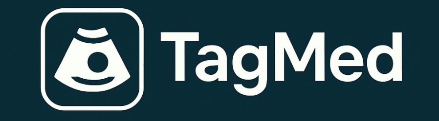

# TagMed
 


<div align="center">
 <table align="center">
   <tr>
     <td><a href="https://arxiv.org" target="_blank"></a></td>
     <td><a href="https://www.uniklinik-duesseldorf.de/patienten-besucher/klinikeninstitutezentren/klinik-fuer-gastroenterologie-hepatologie-und-infektiologie/forschung-und-lehre/arbeitsgruppen/ag-luedde" target="_blank"></a></td>
     <td><a href="https://github.com/janikhohmann/TagMed" target="_blank"></a></td>
   </tr>
 </table>
</div>


## Overview
TagMed is designed to facilitate the annotation of sensitive ultrasound images and corresponding medical reports for computer vision projects. 

## Features
Medical image annotation, particularly in ultrasound, requires precision, efficiency, and a secure workflow. This tool aims to:

- Provide a simple and intuitive interface for annotating medical data with bounding boxes, polygons and class assignment.
- Allow creation and classification of bounding boxes on image frames.
- Support video annotation with frame navigation and object tracking using the automated assistance of [SAM2](https://github.com/facebookresearch/sam2) and [MedSAM2](https://github.com/bowang-lab/MedSAM2).
- Designed to handle sensitive medical data locally.
    
## Quick Start

### 1. Installation

**Clone the repository:**
```bash
git clone https://github.com/janikhohmann/TagMed.git
cd TagMed
```

**Install all requirements:**
```bash
python setup_TagMed.py
```

**Activate the environment:**
```bash
source tagmed-env/bin/activate
```

### 2. Usage

**Start TagMed:**
```bash
cd src
python main.py
```

**Basic workflow:**
1. Load your medical image database
2. Select patient and examination
3. Choose annotation type (bounding box or polygon)
4. Annotate your images/videos
5. Use SAM2/MedSAM2 tracking for automated propagation across video frames
6. Export annotations for your computer vision projects

*INSERT SCREENSHOTS HERE*

## File Structure

#### Annotation Table
Bounding box annotations are saved in [x,y,h,w,]-format. Helper functions for converting to the SAM2 format and reading from the annotation table are available.
When using TagMed, an annotation table is automatically created for you and your ImageDatabase. To ensure everything works correctly, please follow the data structure outlined below.

#### Your Database
```
ImageDatabase
├── Patient 1
    ├── Exam 1
        ├── Image 1
        ├── Image 2
        ├── Video 1
        ├── Frame 1 of Video 1
    ├── Exam 2
├── Patient 2
    ├── Exam 1
```
We recommend that you name or number your images as follows: <br>
```
{num_patient}_{num_exam}_{num_image}
Example: 000001_01_00001.jpg
```
Videos should be named in the same pattern. If your videos already are framed add the frame number as suffix.
```
{num_patient}_{num_exam}_{num_image}_frame{num_frame}
Example: 000001_01_00001_frame00001.jpg
```

#### Medical Reports
To use this function, a table containing all medical reports is required.
TagMed searches for the patient and exam identifiers in the annotation table and returns the corresponding columns from the medical reports file.
For more insights, please take a look at the available example reports.

## Citation
If you use TagMed in your research, please cite:

```
[to be added]
```

If you used the tracking feature implemented in TagMed, please also cite the corresponding publications:

SAM2
```
@article{ravi2024sam2,
  title={SAM 2: Segment Anything in Images and Videos},
  author={Ravi, Nikhila and Gabeur, Valentin and Hu, Yuan-Ting and Hu, Ronghang and Ryali, Chaitanya and Ma, Tengyu and Khedr, Haitham and R{\"a}dle, Roman and Rolland, Chloe and Gustafson, Laura and Mintun, Eric and Pan, Junting and Alwala, Kalyan Vasudev and Carion, Nicolas and Wu, Chao-Yuan and Girshick, Ross and Doll{\'a}r, Piotr and Feichtenhofer, Christoph},
  journal={arXiv preprint arXiv:2408.00714},
  url={https://arxiv.org/abs/2408.00714},
  year={2024}
}
```
MedSAM2
```
@article{MedSAM2,
    title={MedSAM2: Segment Anything in 3D Medical Images and Videos},
    author={Ma, Jun and Yang, Zongxin and Kim, Sumin and Chen, Bihui and Baharoon, Mohammed and Fallahpour, Adibvafa and Asakereh, Reza and Lyu, Hongwei and Wang, Bo},
    journal={arXiv preprint arXiv:2504.03600},
    year={2025}
}
```
EfficientTAM
```
@article{xiong2024efficienttam,
    title={Efficient Track Anything},
    author={Yunyang Xiong, Chong Zhou, Xiaoyu Xiang, Lemeng Wu, Chenchen Zhu, Zechun Liu, Saksham Suri, Balakrishnan Varadarajan, Ramya Akula, Forrest Iandola, Raghuraman Krishnamoorthi, Bilge Soran, Vikas Chandra},
    journal={preprint arXiv:2411.18933},
    year={2024}
}
```


## Support

For questions, issues, or contributions:
- Create an issue on GitHub
- Email: Janik.Hohmann@med.uni-duesseldorf.de

## License
Please use this tool under **License [TO BE DONE]** with citing our paper.<br>
Design: Copyright (c) 2021 [rdbende](https://github.com/rdbende/Azure-ttk-theme) with MIT License. 
